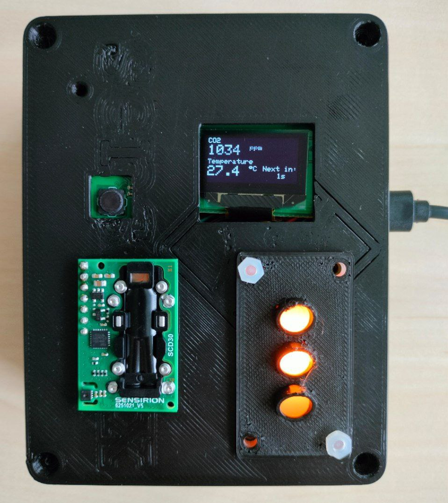
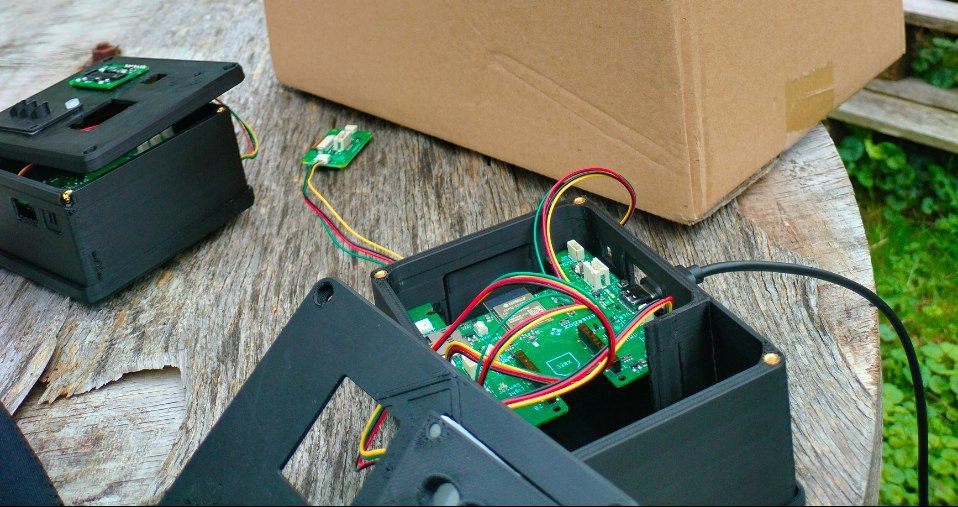
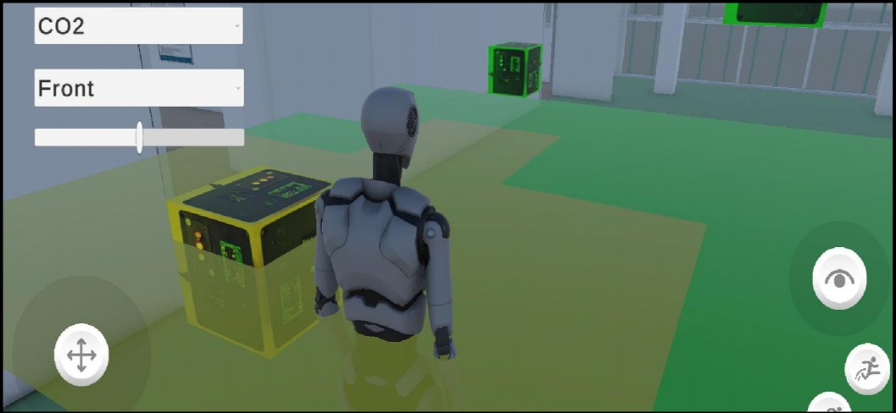
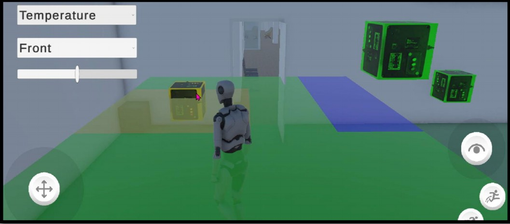

# ESP32 + Unity 3D CO2 & Temperature Monitoring Project

This project integrates real-time **CO2 and temperature sensor data** with a **3D Unity visualization** and the **IFGI Digital Twin**. It includes interactive UI elements for enhanced data exploration.

---

## Features
- Real-time CO2 and temperature data acquisition using ESP32 sensors
- Interactive 3D visualization in Unity
- Integration with IFGI Digital Twin for spatial context
- UI for switching between CO2 and Temperature visualization
- Supports multiple sensor inputs

---

## Hardware
- ESP32 SenseBoxMCU
- CO2 Sensor – Sensirion SCD30
- Temperature Sensor – HDC1080
- Optional: OLED Display, LED Matrix, and other peripherals

---

## Software / Tools
- Unity 3D
- IFGI Digital Twin platform
- Arduino IDE for ESP32
- Unity plugins for real-time data fetching

---

## Visualization in Unity

1. **Direct Mapping**  
   Each sensor location in Unity changes its color (green/yellow/red) to reflect the measured CO₂ level and green/yellow/blue for temperature. This mirrors a traffic light metaphor in 3D for intuitive visualization.

2. **3D Interpolation (Inverse Distance Weighting – IDW)**  
   Instead of showing only point values, the room volume is sampled into a grid. Each grid point’s value is interpolated from the deployed sensors using IDW. Voxels/tiles are generated and colored based on interpolated CO₂ or temperature. Users can switch between CO₂ mode and Temperature mode via the UI.

3. **2D Plane Heatmap**  
   A horizontal slice of the room is generated (front, middle, back) using the UI. This allows top-down heatmap analysis of a single floor layer.

---

## Screenshots

### SenseBox Setup

### Wiring Diagram

### Unity Visualization Co2 

### Unity Visualization temp

---

## How to Run
1. Connect your ESP32 to the CO2 and temperature sensors.
2. Upload the `.ino` Arduino sketch to your ESP32 using Arduino IDE.
3. Open the Unity project.
4. Configure the real-time data plugin to connect to your ESP32 sensors or IFGI Digital Twin endpoints.
5. Run the Unity scene to visualize live sensor data with interactive UI.

---

## License
**All Rights Reserved** – This project is proprietary.  
You may **not copy, modify, distribute, or use** this code or assets without explicit written permission from the author.

---

## Contact
For questions or collaboration, contact: **[Your Name / Email]**
